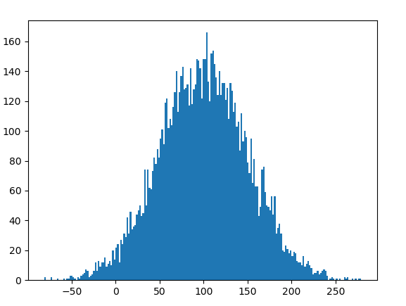

## **gauss  ()**

es un método incorporado del `random`módulo. Se utiliza para devolver un número de punto flotante aleatorio con [distribución gaussiana](https://en.wikipedia.org/wiki/Normal_distribution) 

### Distribucion gausiana

La distribución gaussiana, también conocida como distribución normal, es una distribución de probabilidad continua que se utiliza comúnmente en estadística y en muchos campos de la ciencia. Esta distribución se describe mediante dos parámetros: la media (μ) y **la desviación estándar** (σ).

La forma de la distribución gaussiana es una campana simétrica alrededor de la media. La mayoría de los valores se encuentran cerca de la media, y la probabilidad disminuye a medida que se alejan de ella. La desviación estándar determina la anchura de la campana: cuanto mayor sea la desviación estándar, más ancha será la campana y mayor será la dispersión de los valores.

La distribución gaussiana tiene muchas aplicaciones prácticas, ya que se puede utilizar para modelar muchos fenómenos naturales y sociales, como la altura de las personas, los errores de medición, los tiempos de reacción y muchas otras variables. Además, la distribución gaussiana tiene algunas propiedades importantes, como la propiedad de la suma de variables aleatorias normales, que la hace útil en muchas áreas de la estadística y la física.

### Interpolación directa de Gauss

La interpolación se refiere al proceso de crear nuevos puntos de datos dados dentro del conjunto de datos dado. El siguiente código calcula el punto de datos deseado dentro del rango dado de conjuntos de datos discretos usando la fórmula dada por Gauss y este método se conoce como método directo de Gauss. 

**Método directo de Gauss:**

La interpolación gaussiana viene bajo las fórmulas de interpolación de diferencia central. Supongamos que se nos da el siguiente valor de y=f(x) para un conjunto de valores de x: X
: x0 x1 x2 ………. xn 
Y: y0 y1 y2 ………… yn 
Las diferencias y1 – y0, y2 – y1, y3 – y2, ……, yn – yn–1 cuando se denotan por Δy0, Δy1, Δy2, ……, Δyn–1 son respectivamente , llamado las primeras diferencias hacia adelante. Así, las primeras diferencias directas son:
Δy ~0~ = y ~1~ – y ~0~
y de la misma manera podemos calcular diferencias de orden superior.

### Ejemplo code:

**Producción :**

<pre>127.80261974806497</pre>

Producción :

## ****sample ()**** 

es una función incorporada del**** módulo aleatorio**** en Python que devuelve una lista de longitud particular de elementos elegidos de la secuencia, es decir, lista, tupla, cadena o conjunto. Se utiliza para muestreo aleatorio sin reemplazo.

### **Sintaxis:** 

random.sample(secuencia, k)

**Parámetros:**
**secuencia** : puede ser una lista, una tupla, una cadena o un conjunto.
**k** : Un valor entero, especifica la longitud de una muestra.

**Devuelve:** k longitud nueva lista de elementos elegidos de la secuencia.

### Ejemplo code:

Producto == 

<pre>[2, 3, 5]</pre>

## El **shuffle()**

 es un método incorporado del módulo aleatorio. Se utiliza para barajar una secuencia (lista). **Barajar una lista de objetos** significa cambiar la posición de los elementos de la secuencia usando [Python](https://www.geeksforgeeks.org/random-shuffle-function-in-python/The%20order%20of%20the%20items%20in%20a%20sequence,%20such%20as%20a%20list,%20is%20rearranged%20using%20the%20shuffle()%20method.%20This%20function%20modifies%20the%20initial%20list%20rather%20than%20returning%20a%20new%20one.)

### Sintaxis 

random.shuffle() 

El orden de los elementos en una secuencia, como una lista, se reorganiza mediante el método shuffle(). Esta función modifica la lista inicial en lugar de devolver una nueva.

> **Sintaxis:** random.shuffle(secuencia, función)
>
> **Parámetros:**
>
> * secuencia: puede ser una lista 
> * función: opcional y por defecto es aleatorio(). Debe devolver un valor entre 0 y 1.
>
> **Devoluciones:** nada 

### Ejemplo code:

**Producción :**

<pre>Lista original:
['A B C D E']

Después de la primera mezcla:
['A', 'B', 'E', 'C', 'D']

Después de la segunda mezcla:
['C', 'E', 'B', 'D', 'A']</pre>

## Assert ()

son las herramientas de depuración que ayudan a que el código fluya sin problemas. Las aserciones son principalmente suposiciones que un programador sabe o siempre quiere que sean ciertas y, por lo tanto, las incluye en el código para que su falla no permita que el código se ejecute más. 

En términos más simples, podemos decir que la afirmación es la expresión booleana que comprueba si la afirmación es verdadera o falsa. Si la declaración es verdadera, no hace nada y continúa la ejecución, pero si la declaración es falsa, detiene la ejecución del programa y arroja un error.

En python, **assert** la palabra clave ayuda a lograr esta tarea. Esta declaración toma como entrada una condición booleana, que cuando devuelve verdadero no hace nada y continúa el flujo normal de ejecución, pero si se calcula que es falso, genera un AssertionError junto con el mensaje opcional proporcionado. 

> **Sintaxis:** afirmar condición, mensaje_error (opcional) 
>
> **Parámetros: **
> **condición:** la condición booleana que devuelve verdadero o falso. 
> **error_message:** el argumento opcional que se imprimirá en la consola en caso de AssertionError
>
> **Devoluciones:**
> devuelve AssertionError, en caso de que la condición se evalúe como falsa junto con el mensaje de error que se proporcionó. 

### Ejemplo code:

**Producto :**

<pre>El valor de a/b es: 
------------------------------------------ --------------------------------- 
Rastreo de error de aserción (última llamada más reciente) 
Entrada en [19], en <celda línea: 10>() 
      8 # uso de afirmación para verificar 0 
      9 print("El valor de a / b es : ") 
---> 10 afirmación b != 0 
     11 print(a / b) 

AssertionError:</pre>
